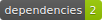

# Amadeus Node SDK

[](https://www.npmjs.com/package/amadeus)
[](https://github.com/amadeus4dev/amadeus-node/actions/workflows/build.yml)
[](https://codeclimate.com/github/amadeus4dev/amadeus-node/maintainability)
[](https://www.npmjs.com/package/amadeus?activeTab=dependencies)
[](https://discord.gg/cVrFBqx)

Amadeus provides a rich set of APIs for the travel industry. For more details, check out the [Amadeus for Developers Portal](https://developers.amadeus.com) or the [SDK class reference](https://amadeus4dev.github.io/amadeus-node/).

## Installation

This module has been tested using [Node LTS versions](https://nodejs.org/en/about/releases/). You can install it using Yarn or NPM.

```sh
npm install amadeus --save
```

## Getting Started

To make your first API call, you will need to [register](https://developers.amadeus.com/register) for an Amadeus Developer Account and [set up your first application](https://developers.amadeus.com/my-apps).

```js
var Amadeus = require('amadeus');

var amadeus = new Amadeus({
  clientId: 'REPLACE_BY_YOUR_API_KEY',
  clientSecret: 'REPLACE_BY_YOUR_API_SECRET'
});

amadeus.shopping.flightOffersSearch.get({
    originLocationCode: 'SYD',
    destinationLocationCode: 'BKK',
    departureDate: '2022-06-01',
    adults: '2'
}).then(function(response){
  console.log(response.data);
}).catch(function(responseError){
  console.log(responseError.code);
});
```

## Examples

You can find all the endpoints in self-contained [code examples](https://github.com/amadeus4dev/amadeus-code-examples).

## Initialization

The client can be initialized directly.

```js
// Initialize using parameters
var amadeus = new Amadeus({
  clientId: 'REPLACE_BY_YOUR_API_KEY',
  clientSecret: 'REPLACE_BY_YOUR_API_SECRET'
});
```

Alternatively, it can be initialized without any parameters if the environment variables `AMADEUS_CLIENT_ID` and `AMADEUS_CLIENT_SECRET` are present.

```js
var amadeus = new Amadeus();
```

Your credentials can be found on the [Amadeus dashboard](https://developers.amadeus.com/my-apps).

By default, the SDK environment is set to `test` environment. To switch to a `production` (pay-as-you-go) environment, please switch the hostname as follows:

```js
var amadeus = new Amadeus({
  hostname: 'production'
});
```

## Documentation

Amadeus has a large set of APIs, and our documentation is here to get you started today. Head over to our [reference documentation](https://amadeus4dev.github.io/amadeus-node/) for in-depth information about every SDK method, its arguments and return types.


  * [Get Started](https://amadeus4dev.github.io/amadeus-node/)
  * [Find an Airport](https://amadeus4dev.github.io/amadeus-node/#airports)
  * [Find a Flight](https://amadeus4dev.github.io/amadeus-node/#flightofferssearch)
  * [Get Flight Inspiration](https://amadeus4dev.github.io/amadeus-node/#flightdestinations)

## Making API calls

This library conveniently maps every API path to a similar path. For example, `GET /v2/reference-data/urls/checkin-links?airlineCode=BA` would be:

```js
amadeus.referenceData.urls.checkinLinks.get({ airlineCode: 'BA' });
```

Similarly, to select a resource by ID, you can pass in the ID to the **singular** path. For example,  `GET /v1/shopping/hotelOffers/123/` would be:

```js
amadeus.shopping.hotelOffer('123').get(...);
```

You can make any arbitrary `GET` API call directly with the `.client.get` method as well:

```js
amadeus.client.get('/v2/reference-data/urls/checkin-links', { airlineCode: 'BA' });
```

Or, with a `POST` using `.client.post` method:
```js
amadeus.client.post('/v1/shopping/flight-offers/pricing', JSON.stringify({ data }));
```

## Promises

Every API call returns a `Promise` that either resolves or rejects.

Every resolved API call returns a `Response` object containing a `body` attribute with the raw response. If the API call contained a JSON response, it will parse the JSON into the `result` attribute. If this data contains a `data` key, that will be made available in `data` attribute.

For a failed API call, it returns a `ResponseError`object containing the (parsed or unparsed) response, the request, and an error code.

```js
amadeus.referenceData.urls.checkinLinks.get({
  airlineCode: 'BA'
}).then(function(response){
  console.log(response.body);   //=> The raw body
  console.log(response.result); //=> The fully parsed result
  console.log(response.data);   //=> The data attribute taken from the result
}).catch(function(error){
  console.log(error.response); //=> The response object with (un)parsed data
  console.log(error.response.request); //=> The details of the request made
  console.log(error.code); //=> A unique error code to identify the type of error
});
```

## Pagination

If an API endpoint supports pagination, the other pages are available under the `.next`, `.previous`, `.last` and `.first` methods.

```js
amadeus.referenceData.locations.get({
  keyword: 'LON',
  subType: 'AIRPORT,CITY'
}).then(function(response){
  console.log(response.data); // first page
  return amadeus.next(response);
}).then(function(nextResponse){
  console.log(nextResponse.data); // second page
});
```

If a page is not available, the response will resolve to `null`.

## Logging & Debugging

The SDK makes it easy to add your own logger that is compatible with the default `console`.

```js
var amadeus = new Amadeus({
  clientId: 'REPLACE_BY_YOUR_API_KEY',
  clientSecret: 'REPLACE_BY_YOUR_API_SECRET',
  logger: new MyConsole()
});
```

Additionally, to enable more verbose logging, you can set the appropriate level on your own logger. The easiest way would be to enable debugging via a parameter during initialization, or using the `AMADEUS_LOG_LEVEL` environment variable. The available options are `silent` (default), `warn`, and `debug`.

```js
var amadeus = new Amadeus({
  clientId: 'REPLACE_BY_YOUR_API_KEY',
  clientSecret: 'REPLACE_BY_YOUR_API_SECRET',
  logLevel: 'debug'
});
```

## List of supported endpoints

```js
//Airport Routes 
amadeus.airport.directDestinations.get({
     departureAirportCode: 'CDG',
})

//Airline Routes
//find all destinations served by a given airline
amadeus.airline.destinations.get({
     airlineCode: 'BA',
 })

// Flight Inspiration Search
amadeus.shopping.flightDestinations.get({
  origin : 'MAD'
})

// Flight Cheapest Date Search
amadeus.shopping.flightDates.get({
  origin : 'MAD',
  destination : 'MUC'
})

// Flight Offers Search GET
amadeus.shopping.flightOffersSearch.get({
  originLocationCode: 'SYD',
  destinationLocationCode: 'BKK',
  departureDate: '2022-11-01',
  adults: '2'
})

// Flight Offers Search POST
// A full example can be found at https://github.com/amadeus4dev/amadeus-code-examples
amadeus.shopping.flightOffersSearch.post(body)

// Flight Offers Price
amadeus.shopping.flightOffersSearch.get({
    originLocationCode: 'SYD',
    destinationLocationCode: 'BKK',
    departureDate: '2022-11-01',
    adults: '1'
}).then(function(response){
    return amadeus.shopping.flightOffers.pricing.post(
      JSON.stringify({
        'data': {
          'type': 'flight-offers-pricing',
          'flightOffers': [response.data[0]]
        }
      })
    )
}).then(function(response){
    console.log(response.data);
}).catch(function(responseError){
    console.log(responseError);
});

// Flight Create Orders
// To book the flight-offer(s) returned by the Flight Offers Price
// and create a flight-order with travelers' information.
// A full example can be found at https://git.io/JtnYo
amadeus.booking.flightOrders.post(
  JSON.stringify({
    'type': 'flight-order',
    'flightOffers': [priced-offers],
    'travelers': []
  })
)

// Retrieve flight order with ID 'XXX'. This ID comes from the
// Flight Create Orders API, which is a temporary ID in test environment.
amadeus.booking.flightOrder('XXX').get()

// Cancel flight order with ID 'XXX'. This ID comes from the
// Flight Create Orders API, which is a temporary ID in test environment.
amadeus.booking.flightOrder('XXX').delete()

// Flight SeatMap Display
// To retrieve the seat map of each flight included
// in flight offers for MAD-NYC flight on 2021-08-01
amadeus.shopping.flightOffersSearch.get({
  originLocationCode: 'SYD',
  destinationLocationCode: 'BKK',
  departureDate: '2022-11-01',
  adults: '1'
}).then(function(response){
    return amadeus.shopping.seatmaps.post(
      JSON.stringify({
        'data': [response.data[0]]
      })
    );
}).then(function(response){
    console.log(response.data);
}).catch(function(responseError){
    console.log(responseError);
});
// To retrieve the seat map for flight order with ID 'XXX'
amadeus.shopping.seatmaps.get({
  'flight-orderId': 'XXX'
});

// Flight Availabilities Search
amadeus.shopping.availability.flightAvailabilities.post(body);

// Branded Fares Upsell 
amadeus.shopping.flightOffers.upselling.post(body);

// Flight Choice Prediction
amadeus.shopping.flightOffersSearch.get({
    originLocationCode: 'SYD',
    destinationLocationCode: 'BKK',
    departureDate: '2022-11-01',
    adults: '2'
}).then(function(response){
    return amadeus.shopping.flightOffers.prediction.post(
      JSON.stringify(response)
    );
}).then(function(response){
    console.log(response.data);
}).catch(function(responseError){
    console.log(responseError);
});

// Flight Checkin Links
amadeus.referenceData.urls.checkinLinks.get({
  airlineCode : 'BA'
})

// Airline Code Lookup
amadeus.referenceData.airlines.get({
  airlineCodes : 'U2'
})

// Airports and City Search (autocomplete)
// Find all the cities and airports starting by 'LON'
amadeus.referenceData.locations.get({
  keyword : 'LON',
  subType : Amadeus.location.any
})

// Get a specific city or airport based on its id
amadeus.referenceData.location('ALHR').get()

// Airport Nearest Relevant Airport (for London)
amadeus.referenceData.locations.airports.get({
  longitude : 0.1278,
  latitude  : 51.5074
})

// Flight Most Booked Destinations
amadeus.travel.analytics.airTraffic.booked.get({
  originCityCode : 'MAD',
  period : '2017-08'
}

// Flight Most Traveled Destinations
amadeus.travel.analytics.airTraffic.traveled.get({
  originCityCode : 'MAD',
  period : '2017-01'
})

// Flight Busiest Traveling Period
amadeus.travel.analytics.airTraffic.busiestPeriod.get({
  cityCode: 'MAD',
  period: '2017',
  direction: Amadeus.direction.arriving
})

// Trip Parser API V3
// parse information from flight, hotel, rail, and rental car confirmation emails
// Parse directly from your confirmation file by using helper `fromFile`
amadeus.travel.tripParser.post(
  JSON.stringify({
  'payload': amadeus.travel.tripParser.fromFile(fs.readFileSync('confirmation.eml')),
  "metadata": {
    "documentType": "eml",
    "name": "BOOKING_DOCUMENT",
    "encoding": "BASE_64"
  }
}))
// Alternatively Parse from a string encoded in BASE_64
amadeus.travel.tripParser.post(
  JSON.stringify({
  'payload': "STRING in BASE_64"
  "metadata": {
    "documentType": "html",
    "name": "BOOKING_DOCUMENT",
    "encoding": "BASE_64"
  }
}))

// City Search API
// finds cities that match a specific word or string of letters. 
// Return a list of cities matching a keyword 'Paris'
amadeus.referenceData.locations.cities.get({
  keyword: 'Paris'
})

//Hotel List API 
//Get list of hotels by city code
amadeus.referenceData.locations.hotels.byCity.get({
      cityCode: 'PAR'
    })

//Get List of hotels by Geocode
amadeus.referenceData.locations.hotels.byGeocode.get({
      latitude: 48.83152,
      longitude: 2.24691
    })

//Get List of hotels by hotelIds
amadeus.referenceData.locations.hotels.byHotels.get({
      hotelIds: 'ACPAR245'
    })

//Hotel Name Autocomplete API
//Autocomplete a hotel search field
amadeus.referenceData.locations.hotel.get({
     keyword: 'PARI',
     subType: 'HOTEL_GDS'
})

// Hotel Search API V2
// Get list of hotels by city code
amadeus.shopping.hotelOffers.get({
  cityCode : 'MAD'
})
// Get list of offers for a specific hotel
amadeus.shopping.hotelOffersByHotel.get({
  hotelId : 'XKPARC12'
})
// Confirm the availability of a specific offer id
amadeus.shopping.hotelOffer('XXX').get()

// Hotel Search API V3
// Get list of available offers in specific hotels by hotel ids
amadeus.shopping.hotelOffersSearch.get({
    hotelIds: 'RTPAR001',
    adults: '2'
})
// Check offer conditions of a specific offer id
amadeus.shopping.hotelOfferSearch('XXX').get()

// Hotel Booking API
amadeus.booking.hotelBookings.post(
  JSON.stringify({
    'offerId': 'XXX',
    'guests': [],
    'payments': []
    }
  )
)

// On-Demand Flight Status
// What's the current status of my flight?
amadeus.schedule.flights.get({
  carrierCode: 'AZ',
  flightNumber: '319',
  scheduledDepartureDate: '2021-03-13'
})


// Points of Interest
// What are the popular places in Barcelona (based a geo location and a radius)
amadeus.referenceData.locations.pointsOfInterest.get({
  latitude : 41.397158,
  longitude : 2.160873
})

// What are the popular places in Barcelona? (based on a square)
amadeus.referenceData.locations.pointsOfInterest.bySquare.get({
  north: 41.397158,
  west: 2.160873,
  south: 41.394582,
  east: 2.177181
})

// Extract the information about point of interest with ID '9CB40CB5D0'
amadeus.referenceData.locations.pointOfInterest('9CB40CB5D0').get()

// Location Score
amadeus.location.analytics.categoryRatedAreas.get({
  latitude : 41.397158,
  longitude : 2.160873
})

// Safe Place
// How safe is Barcelona? (based a geo location and a radius)
amadeus.safety.safetyRatedLocations.get({
  latitude: 41.397158,
  longitude: 2.160873
})

// How safe is Barcelona? (based on a square)
amadeus.safety.safetyRatedLocations.bySquare.get({
  north: 41.397158,
  west: 2.160873,
  south: 41.394582,
  east: 2.177181
})

// What is the safety information of a location based on its Id?
amadeus.safety.safetyRatedLocation('Q930400801').get()

// Tours and Activities
// What are the best tours and activities in Barcelona?
amadeus.shopping.activities.get({
  latitude: 41.397158,
  longitude: 2.160873
})

// What are the best tours and activities in Barcelona? (based on a Square)
amadeus.shopping.activities.bySquare.get({
  north: 41.397158,
  west: 2.160873,
  south: 41.394582,
  east: 2.177181
})

// Extract the information about an activity with ID '56777'
amadeus.shopping.activity('56777').get()

// Hotel Ratings
// Get Sentiment Analysis of reviews about Holiday Inn Paris Notre Dame.
amadeus.eReputation.hotelSentiments.get({
  hotelIds: 'XKPARC12'
})

// Trip Purpose Prediction
// Forecast traveler purpose, Business or Leisure, together with the probability in the context of search & shopping.
amadeus.travel.predictions.tripPurpose.get({
  originLocationCode: 'NYC',
  destinationLocationCode: 'MAD',
  departureDate: '2021-04-01',
  returnDate: '2021-04-08'
})

// Flight Delay Prediction
// This machine learning API is based on a prediction model that takes the input of the user - time, carrier, airport and aircraft information;
// and predict the segment where the flight is likely to lay.
amadeus.travel.predictions.flightDelay.get({
  originLocationCode: 'BRU',
  destinationLocationCode: 'FRA',
  departureDate: '2020-01-14',
  departureTime: '11:05:00',
  arrivalDate: '2020-01-14',
  arrivalTime: '12:10:00',
  aircraftCode: '32A',
  carrierCode: 'LH',
  flightNumber: '1009',
  duration: 'PT1H05M'
})

// Airport On-time Performance
// Get the percentage of on-time flight departures from JFK
amadeus.airport.predictions.onTime.get({
  airportCode: 'JFK',
  date: '2022-18-01'
})

// Travel Recommendations
amadeus.referenceData.recommendedLocations.get({
  cityCodes: 'PAR',
  travelerCountryCode: 'FR'
})

// Flight Price Analysis
amadeus.analytics.itineraryPriceMetrics.get({
   originIataCode: 'MAD',
   destinationIataCode: 'CDG',
   departureDate: '2022-03-13',
 })

// Travel Restrictions
// The Travel Restrictions API provides up-to-date data on COVID-19 caseloads and travel restrictions for over 200 countries and territories,
// as well as hundreds of cities and regions worldwide.

// Travel Restrictions API v2 
amadeus.dutyOfCare.diseases.covid19Report.get({
  countryCode: 'US',
  cityCode: 'NYC',
  language: 'EN'
});

// Travel Restrictions API v1
amadeus.dutyOfCare.diseases.covid19AreaReport.get({
  countryCode: 'US',
  cityCode: 'NYC' 
});
 
```

## Development & Contributing

Want to contribute? Read our [Contributors Guide](.github/CONTRIBUTING.md) for guidance on installing and running this code in a development environment.

## License

This library is released under the [MIT License](LICENSE).

## Help

You can find us on [StackOverflow](https://stackoverflow.com/questions/tagged/amadeus) or join our developer community on
[Discord](https://discord.gg/cVrFBqx).

[npmjs]: https://www.npmjs.com/package/amadeus
